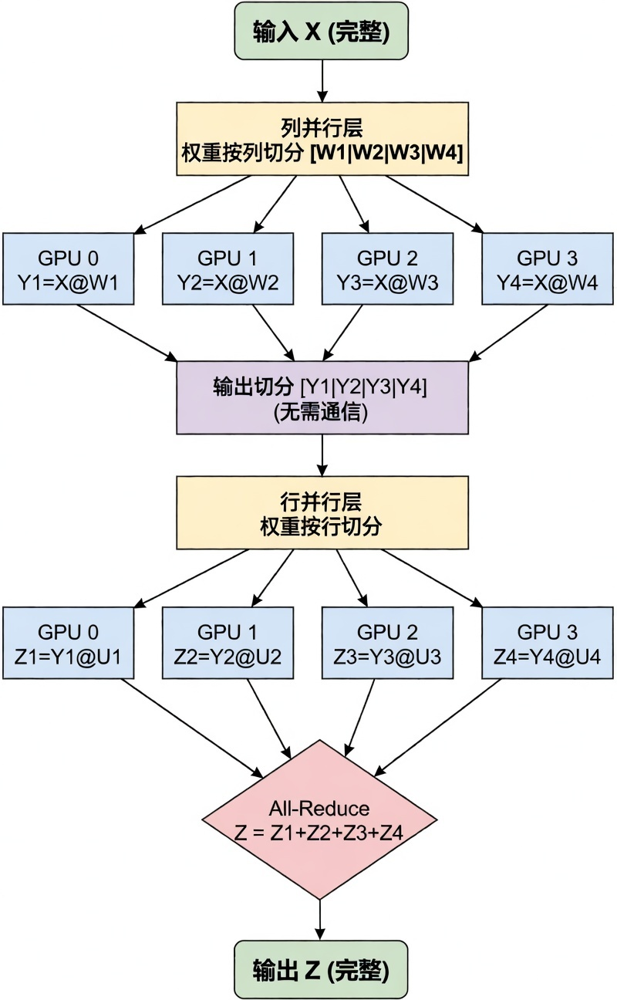
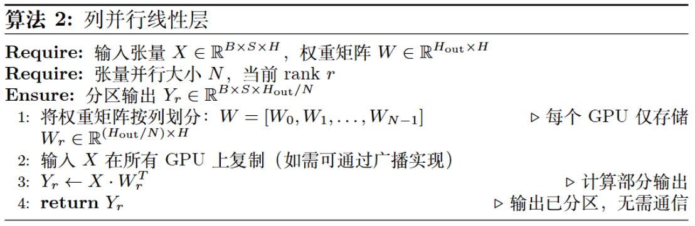
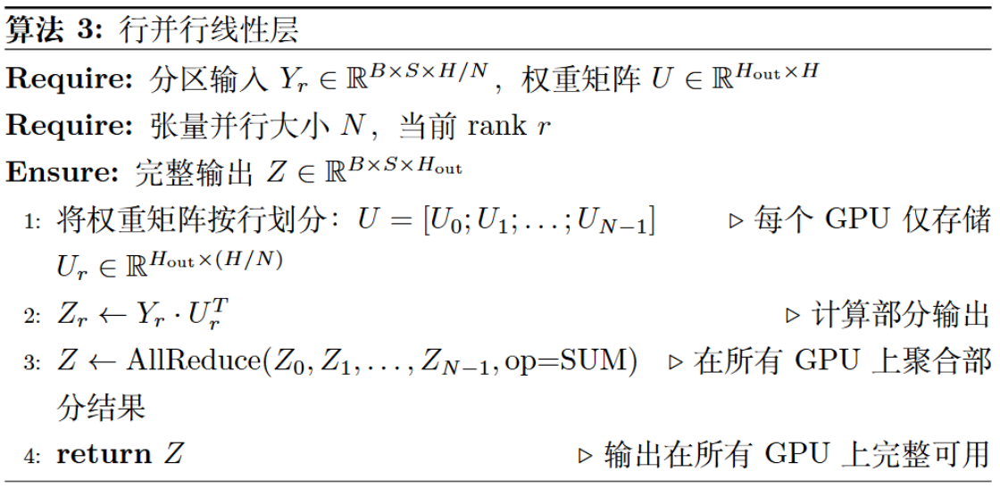
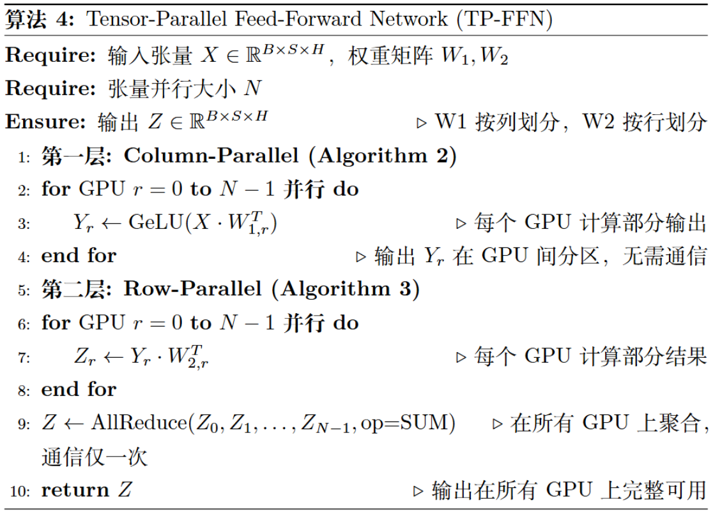

# SPTD 并行

!!! note "在了解了本节的的内容之后，你会对 verl 中的 batch、mini batch、micro batch 这几个参数有一定的理解，可以知道它们到底使用在哪里，有什么作用。"

随着大语言模型参数量的持续增加，单机单卡的算力与显存已经远远无法满足模型训练的要求。为了提高模型训练的效率，业内逐步形成了一套融合多种并行思路的混合框架，即 SPTD 并行。该策略主要用于对 Transformer 架构进行并行优化，通过多维度切分计算与存储负载，适配 Transformer 大模型的结构特性。

SPTD 并行之所以高效，是因为它涵盖的四个策略分别解决了 Transformer 大模型不同维度的挑战：

1. 序列并行（Sequence Parallelism, SP）专注于应对 Transformer 注意力机制中，序列长度增长带来的显存压力；
2. 流水线并行（Pipeline Parallelism, PP）解决了 Transformer 模型深度（层数）过大而无法单机容纳的难题；
3. 张量并行（Tensor Parallelism, TP）则攻克了 Transformer 单层宽度（如注意力头数量、前馈网络维度）过大导致的参数量瓶颈；
4. 数据并行（Data Parallelism, DP）则从根本上扩展了数据吞吐能力，实现 Transformer 大模型训练的规模化加速。

## 数据并行 DP

数据并行是最为经典且广泛应用的并行策略，其核心思想可概括为“模型复制，数据分片”，在 Transformer 大模型训练中是提升吞吐率的基础手段。

在数据并行模式下，每个参与训练的 GPU 都会保有一份完整的 Transformer 模型副本（包括所有注意力层、前馈网络层的参数）。训练开始时，一个大的数据批次（Batch）会被切分成多个子批次（mini-batch），并分发给不同的 GPU。每个 GPU 独立对自己分到的数据进行前向传播（计算 Transformer 各层的激活值与损失）、反向传播（计算各层参数的梯度），至此完成对模型参数的“修改意见”计算。

下一步是梯度同步，这一聚合步骤的有效性源于梯度计算的基本数学原理：

$$
\frac{\partial \mathrm{Loss}(D)}{\partial w}
= \frac{\partial}{\partial w} \left( \frac{1}{N} \sum_{i=1}^N \mathrm{Loss}(x_i, y_i) \right)
= \frac{1}{N} \sum_{i=1}^N \frac{\partial \mathrm{Loss}(x_i, y_i)}{\partial w}
$$

如上述公式所示，对于整个数据批次 $D$ 的总损失 $\mathrm{Loss}(D)$，其关于 Transformer 模型权重（如注意力层的查询/键/值矩阵、前馈网络的权重矩阵）的梯度，等价于各样本梯度的均值。这一原理允许每个 GPU 独立计算子批次梯度，再通过 All-Reduce 集体通信操作聚合所有梯度并取平均，得到全局梯度。最后，每个 GPU 用全局梯度更新本地模型副本，确保迭代前所有设备的 Transformer 参数完全一致。

$$
\begin{aligned}
&\text{算法 1: Distributed Data Parallel Training} \\
&\text{Require: } M, \mathcal{D}, N, B \\
&\text{Ensure: } \theta \\
&1: \quad \text{每个 GPU 初始化模型副本，学习率 } \alpha \\
&2: \quad \textbf{for } \text{epoch} = 1 \textbf{ to } \text{num_epochs do} \\
&3: \quad \quad \textbf{for each } \text{global_batch} \in \mathcal{D} \textbf{ do} \\
&4: \quad \quad \quad \hat{y}_i \gets M(\text{local_batch}_i) \\
&5: \quad \quad \quad \mathcal{L}_i \gets \text{Loss}(\hat{y}_i, y_i) \\
&6: \quad \quad \quad g_i \gets \nabla_\theta \mathcal{L}_i \\
&7: \quad \quad \quad g_{\text{global}} \gets \text{AllReduce}(\{g_i\}_{i=0}^{N-1}, \text{AVG}) \\
&8: \quad \quad \quad \theta \gets \theta - \alpha \cdot g_{\text{global}} \\
&9: \quad \quad \textbf{end for} \\
&10: \quad \textbf{end for} \\
&11: \quad \textbf{return } \theta
\end{aligned}
$$

**DDP 算法在 Transformer 训练中的应用：**如算法 1 所示，DDP 核心流程分为四阶段：首先，大批次数据切分（Data Sharding）后分发给各 GPU（算法 1 第 4 行）；其次，各 GPU 在本地独立执行 Transformer 的前向传播（计算注意力、前馈网络激活值）与反向传播（计算各层梯度）（算法 1 第 5-7 行）；关键的第三步是梯度同步——所有 GPU 通过 All-Reduce 聚合梯度，确保各设备获得一致的全局梯度（算法 1 第 8 行）；最后，各 GPU 用全局梯度更新本地 Transformer 参数（算法 1 第 9 行），完成迭代并保持模型一致性。

## 张量并行 TP

当 Transformer 大模型的单层规模（如注意力头数量过多、前馈网络维度过大）超出单卡容纳能力时，数据并行便无能为力。此时，张量并行通过“层内横向切分”，将 Transformer 单层的大规模矩阵运算分解到多个 GPU 协同完成，是优化 Transformer 层内计算的核心策略。最具代表性的实现是 NVIDIA 的 Megatron-LM，它通过“列并行（Column Parallelism）+行并行（Row Parallelism）”的组合，适配 Transformer 前馈网络、注意力层的矩阵运算特性（如下图所示）。

{width="40%"}

列并行与行并行针对 Transformer 线性层（如前馈网络的 $Y=XA$、注意力层的 $Y=QK^T$）的矩阵运算设计：

- 列并行：将权重矩阵 $A$ 按列切分（$A = [A_1, A_2, \ldots, A_p]$），每个 GPU 计算 $Y_i = XA_i$，最终通过拼接（Concat）得到完整输出 $Y = [Y_1, Y_2, \ldots, Y_p]$ ，此过程无需额外通信；
- 行并行：将权重矩阵 $A$ 按行切分（$A = [A_1; A_2; \ldots, A_p]$），同时将输入 $X$ 按列切分（$X = [X_1, X_2, \ldots, X_p]$），每个 GPU 计算 $Y_i = X_1A_i$，最终通过 All-Reduce 聚合得到完整输出 $Y = [Y_1, Y_2, \ldots, Y_p]$ 。

{width="85%"}

{width="85%"}

在 Transformer 前馈网络（FFN，公式为 $Z=Dropout(GeLU(XW_1))W_2$）中，Megatron-LM 巧妙结合两种并行方式：

1. 第一线性层（$XW_1$）采用列并行：权重 $W_1$ 按列切分，完整输入 $X$ 复制到各 GPU，并行计算 $Y_r=GeLU(X \dot W_{1,r})$——此时 $Y_r$ 是分散存储的，恰好匹配下一层行并行的输入需求；
2. 第二线性层（$YW_2$）采用行并行：权重 $W_2$ 按行切分，各 GPU 直接用本地 $Y_r$ 计算 $Z_r=Y_r \dot W_{2,r}$，省去层间数据聚合（如 All-Gather）的通信开销；
3. 最终通过一次 All-Reduce 聚合 $Z_r$，得到完整的 FFN 输出 $Z$（如算法 4 所示）。

{width="85%"}

## 流水线并行 PP

与张量并行在 Transformer 层内“横向切分”不同，流水线并行是“纵向切分”策略：将 Transformer 大模型的上百层网络（如 GPT-3 的 96 层）按顺序切分成多个连续阶段，每个阶段由一个或一组 GPU 负责。训练时，数据像流水线一样流经各阶段——前一阶段完成 Transformer 某几层的计算后，将激活值传递给下一阶段，直至完成全量前向传播；反向传播则从最后一个阶段反向传递梯度至第一个阶段。

这种模式天然适配 Transformer“多层堆叠”的结构特性，非常适合跨节点、跨服务器场景——阶段间仅需传递激活值/梯度，对节点间通信带宽的要求远低于张量并行。

流水线并行的核心挑战是“流水线气泡（Pipeline Bubble）”：启动和排空阶段部分 GPU 空闲，导致资源利用率下降。为优化这一问题，现代方案（如 GPipe、PipeDream）引入“微批次（Micro-batch）+1F1B（One Forward, One Backward）”调度，适配 Transformer 的迭代训练特性：

1. 将大批次数据切分成多个微批次，交错执行前向/反向传播；
2. 一个微批次完成某阶段前向计算后，立即送入下一阶段，无需等待全批次；
3. 某微批次满足反向计算条件（如后续阶段完成其前向）时，立即调度反向传播。

## 序列并行 SP

随着 Transformer 大模型对长文本理解能力的需求增长，输入序列长度（如从 4K 扩展到 128K）急剧增加，带来新的挑战：Transformer 自注意力机制的计算与显存复杂度为（为序列长度），超长序列下 KV Cache、注意力矩阵的显存开销成为瓶颈。序列并行专为解决这一问题设计，它沿着“序列长度维度”切分输入数据，而非在 Transformer 的宽度（TP）或深度（PP）上切分，每个 GPU 仅处理序列的一个片段（Chunk）。

!!! tip "更多信息请查看 [SPTD 并行](https://infrasys-ai.github.io/aiinfra-docs/04Train01ParallelBegin/02SPTD.html)"
